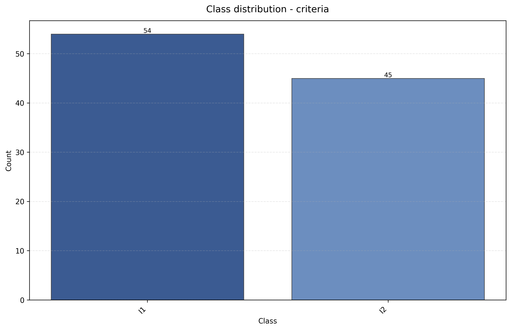
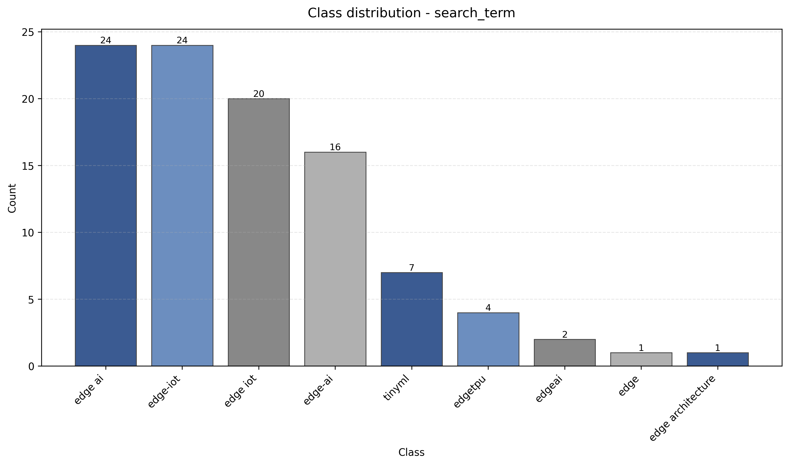
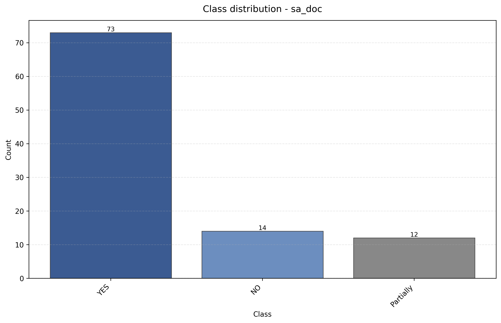
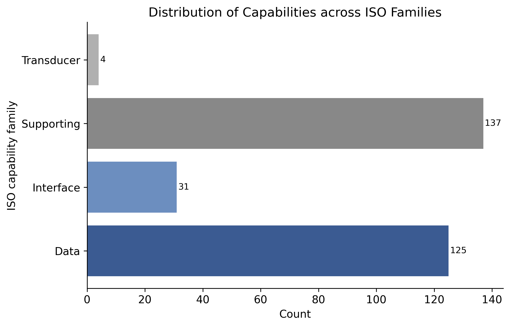
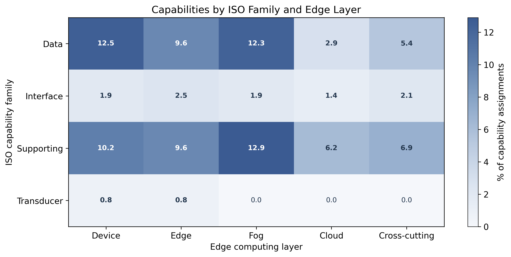
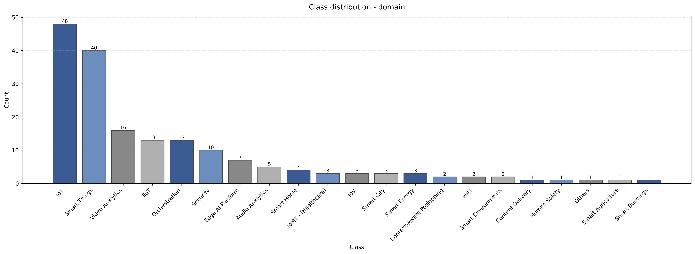
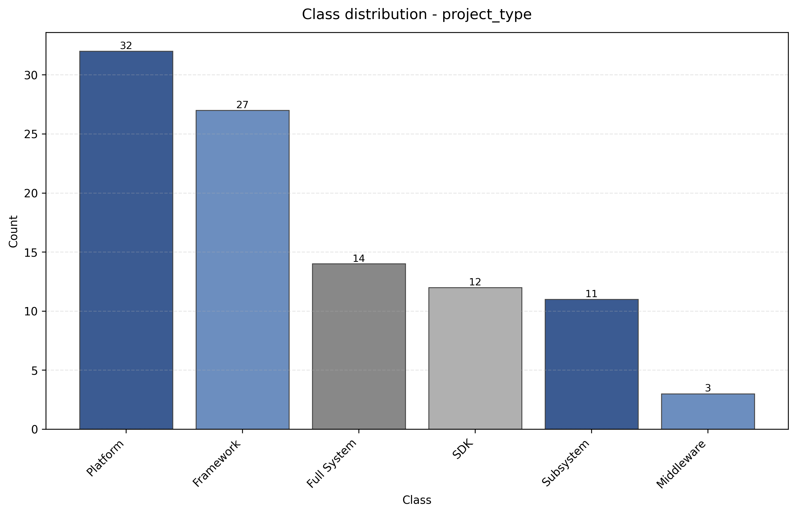
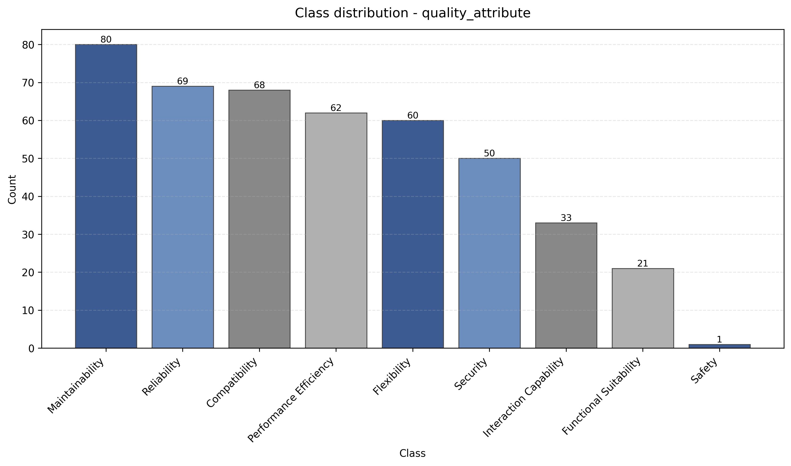

# Empirical Evidence and Supplementary Statistical Analysis

This document provides complementary statistical evidence supporting the empirical findings reported in the main paper. 
Due to space constraints, several detailed distributions, intermediate results, and extended quantitative analyses could 
not be included in the manuscript.

This material should be interpreted as an extension of the empirical results, providing additional granularity and 
supporting the interpretation of the architectural patterns, capability distributions, documentation practices, and 
quality requirements observed in open-source Edge AI-based systems.

## Dataset Construction and Selection

### Inclusion Criteria Distribution

| Criterion | Count | Percentage |
|-----------|-------|------------|
| I1        | 54    | 54.55%     |
| I2        | 45    | 45.45%     |

These results indicate that slightly more than half of the selected repositories correspond to complete Edge AI-based 
systems, while the remaining projects focus primarily on performance optimization for edge environments.

 [Evidence File](../../pipeline/analysis/dataset/study_corpus.csv) `Column: criteria`

### Search Terms Distribution

| Term              | Count | Percentage |
|-------------------|-------|------------|
| edge ai           | 24    | 24.24%     |
| edge-iot          | 24    | 24.24%     |
| edge iot          | 20    | 20.2%      |
| edge-ai           | 16    | 16.16%     |
| tinyml            | 7     | 7.07%      |
| edgetpu           | 4     | 4.04%      |
| edgeai            | 2     | 2.02%      |
| edge              | 1     | 1.01%      |
| edge architecture | 1     | 1.01%      |

The dataset is strongly concentrated around variations of the term "Edge AI" and "Edge IoT", confirming the relevance 
of these keywords for capturing the targeted ecosystem.

[Evidence File](../../pipeline/analysis/dataset/study_corpus.csv) `Column: search_term`

### Documentation Verification

| Label     | Count | Percentage |
|-----------|-------|------------|
| YES       | 73    | 73.74%     |
| NO        | 14    | 14.14%     |
| Partially | 12    | 12.12%     |

Most repositories provide sufficient architectural evidence, although a portion exhibits partial or missing 
documentation, reinforcing the need for fragment-based analysis.

[Evidence File](../../pipeline/analysis/dataset/study_corpus.csv) `Column: sa_doc`

## RQ1 — Capability Distribution

| Capability Family | Count | Percentage |
|-------------------|-------|------------|
| Supporting        | 137   | 46.13%     |
| Data              | 125   | 42.09%     |
| Interface         | 31    | 10.44%     |
| Transducer        | 4     | 1.35%      |

The results show a strong dominance of supporting and data-related capabilities, while transducer-related concerns 
appear only marginally in the analyzed repositories.

[Evidence File](../../pipeline/analysis/dataset/study_corpus.csv) - `Columns: ISO mapping`

### Capability Distribution Across Layers

| Capability | Device | Edge | Fog   | Cloud | Cross-cutting |
|------------|--------|------|-------|-------|---------------|
| Data       | 12.52  | 9.63 | 12.33 | 2.89  | 5.39          |
| Interface  | 1.93   | 2.5  | 1.93  | 1.35  | 2.12          |
| Supporting | 10.21  | 9.63 | 12.91 | 6.17  | 6.94          |
| Transducer | 0.77   | 0.77 | 0.0   | 0.0   | 0.0           |

Values represent normalized distributions of capability occurrences across architectural layers. The results reinforce 
the prominence of fog and device layers, especially for data capabilities.

[Evidence File](../../pipeline/analysis/dataset/study_corpus.csv) - `Columns: Capabilities`

## RQ1 — Application Domains (Multi-label)

| Domain                    | Count | Percentage |
|---------------------------|-------|------------|
| IoT                       | 48    | 26.82%     |
| Smart Things              | 40    | 22.35%     |
| Video Analytics           | 16    | 8.94%      |
| Orchestration             | 13    | 7.26%      |
| IIoT                      | 13    | 7.26%      |
| Security                  | 10    | 5.59%      |
| Edge AI Platform          | 7     | 3.91%      |
| Audio Analytics           | 5     | 2.79%      |
| Smart Home                | 4     | 2.23%      |
| IoMT (Healthcare)         | 3     | 1.68%      |
| IoV                       | 3     | 1.68%      |
| Smart City                | 3     | 1.68%      |
| Smart Energy              | 3     | 1.68%      |
| Context-Aware Positioning | 2     | 1.12%      |
| IoRT                      | 2     | 1.12%      |
| Smart Environments        | 2     | 1.12%      |
| Content Delivery          | 1     | 0.56%      |
| Human Safety              | 1     | 0.56%      |
| Others                    | 1     | 0.56%      |
| Smart Agriculture         | 1     | 0.56%      |
| Smart Buildings           | 1     | 0.56%      |

Domains were treated as multi-label categories. Therefore, percentages exceed 100% when aggregated.

[Evidence File](../../pipeline/analysis/dataset/study_corpus.csv)  `Column: domain`

## RQ1 — Project Types

| Type        | Count | Percentage |
|-------------|-------|------------|
| Platform    | 32    | 32.32%     |
| Framework   | 27    | 27.27%     |
| Full System | 14    | 14.14%     |
| SDK         | 12    | 12.12%     |
| Subsystem   | 11    | 11.11%     |
| Middleware  | 3     | 3.03%      |

The ecosystem is predominantly infrastructure-oriented, with platforms and frameworks accounting for the majority of 
projects.

[Evidence File](../../pipeline/analysis/dataset/study_corpus.csv)  `Column: project_type`

## RQ4 — Quality Attributes

| Quality Attribute      | Count | Percentage |
|------------------------|-------|------------|
| Maintainability        | 80    | 18.02%     |
| Reliability            | 69    | 15.54%     |
| Compatibility          | 68    | 15.32%     |
| Performance Efficiency | 62    | 13.96%     |
| Flexibility            | 60    | 13.51%     |
| Security               | 50    | 11.26%     |
| Interaction Capability | 33    | 7.43%      |
| Functional Suitability | 21    | 4.73%      |
| Safety                 | 1     | 0.23%      |

The results reveal a strong concentration on runtime and evolution-related qualities, while safety-related concerns
are almost absent in the analyzed evidence.

[Evidence File](../evidence/selected_fragments.csv) `Column: quality_attribute`
