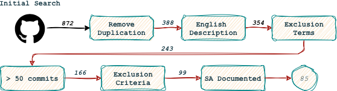

## Overview

This replication package documents the repository-mining and dataset-construction pipeline used in our empirical study
on open-source Edge AI-based systems. The process starts with large-scale GitHub retrieval and continues through 
successive cleaning, screening, and refinement steps until the final study corpus is obtained.

The complete eligibility criteria adopted during manual screening are available in 
[eligibility_criteria.md](../../artifacts/screening/eligibility_criteria.md), while the final corpus analyzed in the study 
is available in [study_corpus.csv](../analysis/dataset/study_corpus.csv).

## 🔍 Step 1 — GitHub Mining Script ([api_search.py](scripts/api_search.py))

---



---

This script performs a structured mining process over GitHub’s REST API to retrieve repositories that match a predefined 
set of Edge AI-related terms. It extracts key metadata —such as commit history, collaborators, stars, programming 
language, and activity over the last year— and stores the results in timestamped CSV files to enable reproducible 
analysis.

### Output

For each search term, the script generates a CSV file under:

```
dataset/raw_data/
```

Each file follows the naming pattern:

```
RAW_<term>_repos_<timestamp>.csv
```

These CSVs form the foundational dataset used in the subsequent filtering, cleaning, and thematic analysis phases.

### How to Run

1. Ensure that all [project dependencies](../INSTALL.md) are installed using Poetry and Activate the virtual environment:

### Authentication

Make sure that your GitHub Personal Access Token (PAT) is set in the `.env` file under the `GITHUB_API_TOKEN` key.
This significantly reduces the chance of rate-limit errors during large-scale mining.

2. Execute the mining script:

   ```bash
   python api_search.py
   ```

3. The script will automatically:

   * Query the GitHub REST API for all predefined Edge AI-related search terms
   * Count total commits 2024 (can be changed in the script)
   * Count contributors
   * Save all enriched repository records into structured CSV files

---


## Step 2 — Dataset Processing & Cleaning ([data_treatment.py](scripts/data_treatment.py))

After collecting raw repository data using the **GitHub Search API script** (`api_search.py`), the next step is to 
**process and refine the dataset** before performing analysis or visualization.  


### Overview

This script performs the following main operations:

|              Option               | Operation                        | Description                                                                                                                       |
|:---------------------------------:|:---------------------------------|:----------------------------------------------------------------------------------------------------------------------------------|
|        **[1] Concatenate**        | Merge multiple raw CSV fragments | Combines files generated by `api_search.py` (stored under `dataset/raw_data`) into a single dataset.                              |
|     **[2] Remove Duplicates**     | Deduplicate repositories         | Removes duplicate entries based on the columns `name`, `full_name`, and `URL`.                                                    |
|  **[3] Filter by Language (EN)**  | Keep only English descriptions   | Detects the language of each repository description and keeps only those written in English.                                      |
| **[4] Filter by Exclusion Terms** | Clean irrelevant repositories    | Excludes repositories containing keywords like `toy`, `tutorial`, `book`, simulator` in their name, description, or search terms. |


1. Execute the treatment script:


>  ```bash
>    python data_treatment.py
>  ```
> 
> === Main Menu === \
> Select the processing type: \
> [1] - Concatenate \
> [2] - Remove Duplicates \
> [3] - Filter by Language Descriptions \
> [4] - Filter by Exclusion Terms \
> ================= \
> **Enter your choice:**


> _Each operation automatically generates timestamped CSV outputs under:_
>
> ```text
>    dataset/
>    ├── raw_data/
>    │   ├── RAW_*_repos_(timestamp).csv
>    │   └── ...
>    └── processed_data/
>        ├── [CONCATENATED]-raw_data-(timestamp).csv
>        ├── [NO-DUPLICATED]_repo-files_(timestamp).csv
>        ├── [ENGLISH-DESC]_repo-files_(timestamp).csv
>        └── [EXCLUSION-TERM]_edgeai_(timestamp).csv
>   
> ```